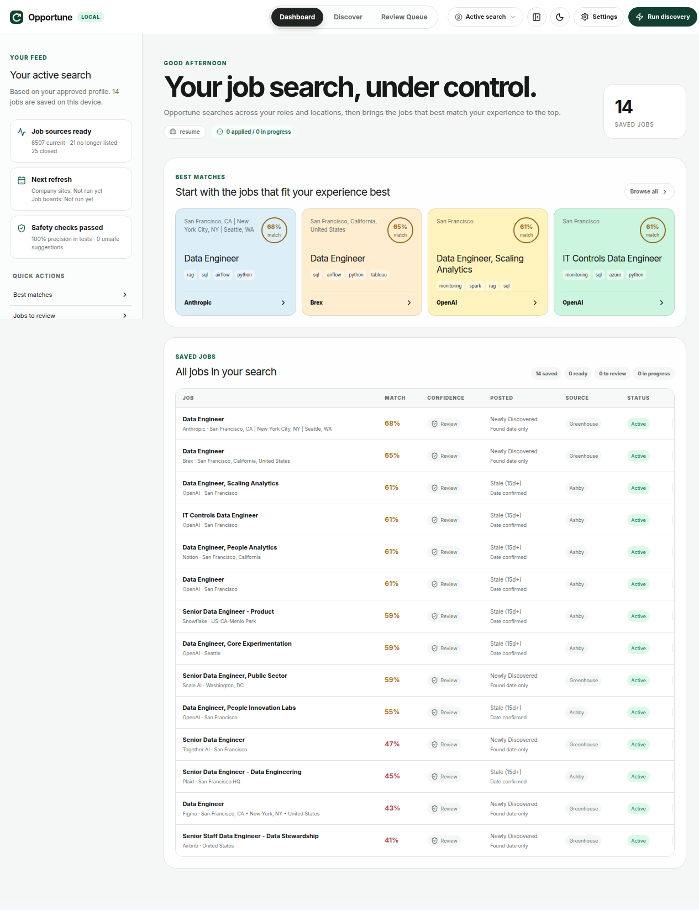
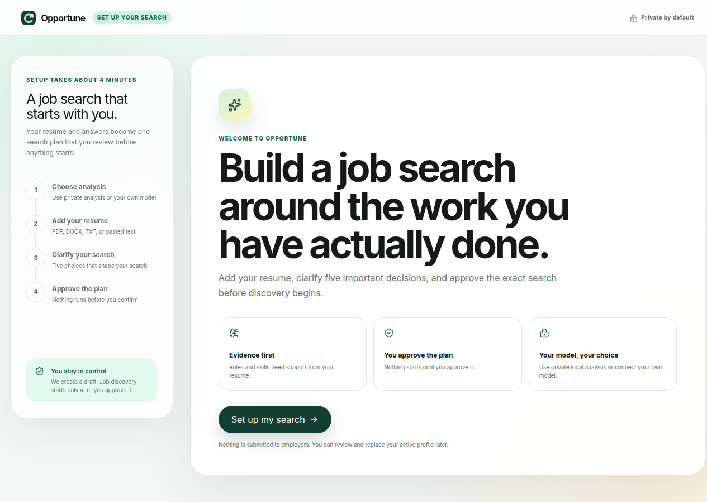

<p align="center">
  
</p>

<h1 align="center">Opportune</h1>

<p align="center">
  A local-first job discovery, ranking, and tracking system built around a search profile you approve.
</p>

<p align="center">
  <a href="https://github.com/RaghuramReddy9/opportune/actions/workflows/ci.yml"></a>
  
  
  
  
  <a href="LICENSE"></a>
</p>

<p align="center"><strong>Right time. Right job. Right skills.</strong></p>

Opportune collects jobs from configured sources, keeps a local discovery pool, and ranks each job against your approved profile. Every recommendation includes the evidence and caution signals behind it. Your jobs, profiles, notes, and application state stay in local SQLite.

Status: early public alpha (`v0.1.0`).

## Why Opportune

Job listings are spread across company career pages, job boards, curated lists, and APIs. Saving everything creates noise; filtering too early hides useful near-matches. Opportune separates those concerns:

1. Discovery gathers a broad role-and-location pool.
2. A local catalog tracks listings over time.
3. Deterministic ranking applies your approved experience, location, level, authorization, freshness, and source rules.
4. The dashboard explains why each job is ready, needs review, or was excluded.

Resume models are optional and limited to onboarding. They do not control scraping, eligibility, ranking, deduplication, or statistics.

## At a glance

| Area | Implementation |
|---|---|
| Runtime | Local Python application; dashboard binds to `127.0.0.1` by default |
| Interface | React + TypeScript dashboard served by FastAPI |
| Storage | SQLite for profiles, jobs, catalog state, notes, and application status |
| Discovery | Direct ATS/company sources, curated lists, and optional APIs |
| Ranking | Deterministic scoring with explicit eligibility and safety gates |
| Resume setup | Built-in local analysis or your own OpenAI, OpenRouter, Ollama, or compatible endpoint |
| Automation | CLI, JSON output, local scheduler, export, backup, and wipe |
| External actions | No automatic applications, email, or outreach in v0.1 |

## Features

- Approval-gated onboarding from resume to a reviewable search plan.
- Multiple local profiles with explicit activation and profile-aware job state.
- Broad discovery before ranking, so near-matches remain available for review.
- Transparent match, freshness, source, eligibility, and apply-window evidence.
- Local job catalog with first-seen, last-seen, changed, missing, and closed states.
- Local React dashboard for filtering, reviewing, and updating jobs.
- Agent-friendly CLI commands with structured JSON responses.
- Privacy operations for local export, backup, and confirmed wipe.

## Screenshots

### Dashboard



### Guided onboarding



## Quickstart

Requirements:

- Python 3.10 or newer
- [uv](https://docs.astral.sh/uv/)
- Node.js 20 or newer for frontend development/builds

```bash
git clone https://github.com/RaghuramReddy9/opportune.git
cd opportune
uv sync

cd frontend
npm ci
npm run build
cd ..

uv run opp start
```

Open `http://127.0.0.1:8770`.

### First-run setup

A fresh installation opens guided onboarding:

1. Choose private local resume analysis or connect your own model.
2. Add a PDF, DOCX, TXT, or Markdown resume, or paste its text.
3. Review the skills and realistic role directions Opportune found.
4. Answer five questions about roles, work focus, experience, location/work mode, and work authorization.
5. Review the complete search plan.
6. Approve it before job discovery can run.

Resume analysis creates a draft. It does not activate discovery on its own.

Existing users can open `http://127.0.0.1:8770/onboarding` to create another profile without deleting current profiles or jobs.

## Resume analysis choices

Onboarding supports:

- private built-in local analysis;
- OpenAI with your own API key;
- OpenRouter with your own key and model;
- a local Ollama model;
- a custom OpenAI-compatible endpoint.

Provider settings are stored locally under `tracker/onboarding/`. API keys are written to a separate file with restricted permissions and are never returned by the browser API.

Before a remote-model request, Opportune removes common email, phone, and street-address patterns. This is a best-effort filter, not a guarantee. Review your provider's privacy policy before sending resume content.

## How configuration works

Opportune has two configuration layers:

1. **Approved search profile in SQLite** — roles, levels, locations, work modes, skills, and work-authorization choices confirmed during onboarding.
2. **`config.yaml`** — source enablement, scheduler timing, storage path, and dashboard host/port.

When an approved profile is active, its search choices take precedence over profile defaults in YAML. This prevents Settings or an old file from silently replacing the plan you approved.

`config.example.yaml` is the public template. `config.yaml` is local and ignored by Git.

```bash
cp config.example.yaml config.yaml
uv run opp config show --json
```

Secrets belong in `.env`, never in YAML or Git.

## Job sources

Sources are explicit records in `config.yaml`:

```yaml
sources:
  - name: free_ats_scrape
    label: Company career pages
    enabled: true
    mode: free
    api_key_env: null

  - name: serpapi_google_jobs
    label: Google Jobs via SerpApi
    enabled: false
    mode: paid
    api_key_env: SERPAPI_API_KEY
```

A source runs only when it is present and enabled. Adding an API key does not enable a paid source automatically.

Apify support is optional:

```bash
uv sync --extra apify
```

Then set `APIFY_TOKEN` before enabling an Apify-backed source.

### Responsible source use

Prefer documented ATS endpoints and licensed APIs. Optional HTML/browser adapters are disabled by default because site terms and robots rules can change.

Do not enable a source unless its current terms permit your use. Respect rate limits and access controls. Opportune does not bypass authentication, CAPTCHAs, or blocking.

`Newly Discovered` means Opportune found a listing during the current run. It does not mean the employer posted it today. A listing needs a confirmed publication date before it can enter the strongest recommendation bucket.

## Discovery and ranking

Acquisition and recommendation are separate:

1. Direct ATS and configured board/API sources build a role-and-location pool.
2. The local catalog records first seen, last seen, content changes, and active/missing/closed state.
3. Ranking uses the active profile, resume evidence, freshness, level, location, and source quality.
4. Safety gates decide whether a job is ready, needs review, or should be excluded.
5. The dashboard keeps the explanation and original listing visible.

Rebuild the local pool without another network scrape:

```bash
uv run opp jobs rebuild-pool --json
```

## Common commands

```bash
# Setup and diagnostics
uv run opp doctor --json
uv run opp quickstart --json
uv run opp tools --json
uv run opp config show --json

# Dashboard and onboarding
uv run opp start

# Discovery
uv run opp scrape --json                 # dry run
uv run opp scrape --live --json          # save results
uv run opp smart --json                  # bounded smart dry run
uv run opp smart --live --json            # bounded smart run, save results

# Local scheduler
uv run opp schedule run --once --json
uv run opp schedule run
uv run opp schedule status --json

# Quality and state
uv run opp quality --json
uv run opp audit --json
uv run opp jobs list --json --limit 20
uv run opp jobs update '<job_uid>' --status watch --note 'review later' --json

# Local data
uv run opp demo --clear --json
uv run opp privacy export --json
uv run opp privacy backup --json
uv run opp privacy wipe --confirm WIPE --json
```

The scheduler stores timing/status metadata in `tracker/scheduler-state.json` and uses `tracker/scheduler.lock` to prevent overlapping runs.

## Local data and privacy

Ignored user-owned data includes:

- `.env`
- `config.yaml`
- `tracker/*.db`
- `tracker/onboarding/*`
- `tracker/backups/*`
- `exports/*`

Tracked resume/profile files are generic fallback examples, not user data.

The dashboard binds to `127.0.0.1` by default. Remote resume providers are optional and disclosed during onboarding. Job-source adapters make network requests only when enabled.

## v0.1 boundaries

Included:

- guided, approval-gated onboarding;
- local profiles and profile switching;
- source discovery and local catalog;
- transparent ranking and quality gates;
- React dashboard;
- local scheduler, export, backup, and wipe;
- CLI and local JSON API.

Deferred:

- email/application evidence sync;
- outreach drafts and sending;
- automatic application submission;
- hosted multi-user service.

The planned email/evidence/outreach design is documented in [`docs/FUTURE_EMAIL_EVIDENCE_OUTREACH.md`](docs/FUTURE_EMAIL_EVIDENCE_OUTREACH.md).

## Development

```bash
uv sync
uv run ruff check .
uv run pytest -q
uv run opp quality --json

cd frontend
npm ci
npm run lint
npm run build
```

See:

- [`ARCHITECTURE.md`](ARCHITECTURE.md)
- [`CONTRIBUTING.md`](CONTRIBUTING.md)
- [`SECURITY.md`](SECURITY.md)
- [`SUPPORT.md`](SUPPORT.md)
- [`MAINTAINING.md`](MAINTAINING.md)
- [`CHANGELOG.md`](CHANGELOG.md)
- [`ROADMAP.md`](ROADMAP.md)
- [`PUBLIC_RELEASE.md`](PUBLIC_RELEASE.md)

## License

MIT. See [`LICENSE`](LICENSE).
